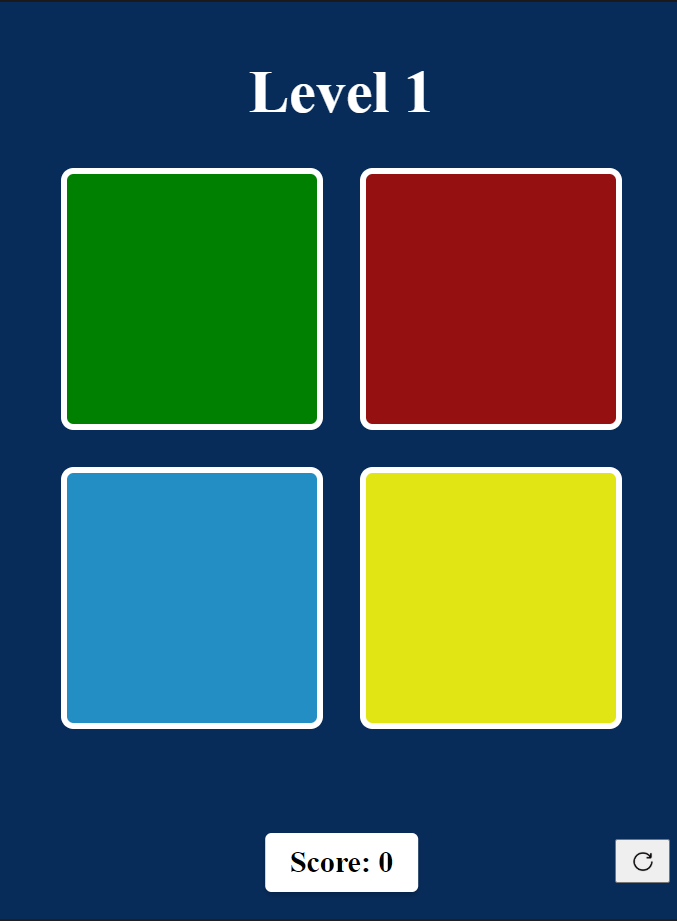

# 🎮 The Simon Game

A classic memory game built with HTML, CSS, and JavaScript where players must remember and repeat sequences of colored lights.

## 🎯 About

The Simon Game is a digital recreation of the classic electronic memory game. Players watch a sequence of colored lights and repeat the pattern by clicking the correct colors in order.

## ✨ Features

- **3 Progressive Levels** with increasing speed
- **Audio Feedback** for correct/wrong clicks and winning
- **Visual Animations** and screen effects
- **Real-time Score Tracking**
- **Responsive Design**

## 🎮 How to Play

1. Click the start button to begin
2. Watch which colored box lights up
3. Click the same colored box that was highlighted
4. Complete 5 rounds to advance to the next level
5. Win by completing all 3 levels!

## Time Limit to click
- **Level 1:** 2 seconds
- **Level 2:** 1.5 seconds
- **Level 3:** 1 second

## 🎨 Game Elements

- **Green (G)**: Top-left box
- **Red (R)**: Top-right box  
- **Blue (B)**: Bottom-left box
- **Yellow (Y)**: Bottom-right box

## 🛠️ Technical Stack

- **HTML5**: Structure
- **CSS3**: Styling and animations
- **JavaScript**: Game logic and interactivity

## 🚀 How to Run

1. Clone the repository
2. Open `index.html` in your browser
3. Start playing!

## 📁 Files

- `index.html` - Main HTML structure
- `styles.css` - CSS styling and animations
- `index.js` - JavaScript game logic
- Audio files: `correct.mp3`, `wrong.mp3`, `winner.mp3`
- Images: `start.png`, `refresh.png`

## 🎯 Game Rules

- **Correct Click**: +1 point, next round
- **Wrong Click**: Game over
- **Time Out**: Game over if too slow
- **Level 1**: 2-second timeout
- **Level 2**: 1.5-second timeout
- **Level 3**: 1-second timeout

**Enjoy playing! 🎮✨**
